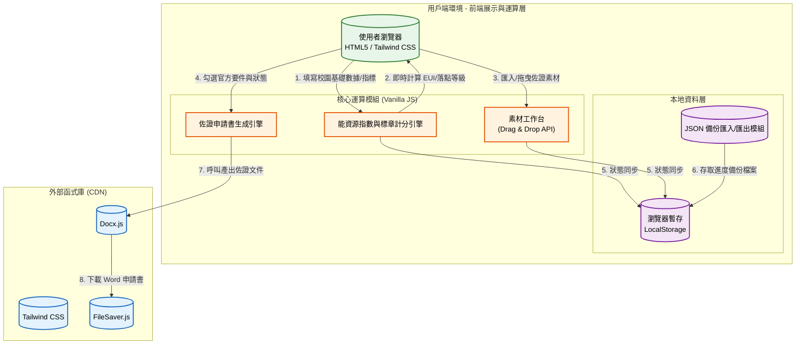

# 碳吉 TanJi：低碳校園標章認證輔助系統 🌿

## 1. 專案介紹

### 1.1 系統目的簡介

本系統旨在協助各級學校（國小、國中、高中職、大專院校）與相關輔導團隊，簡化申請「115 年度新北市低碳校園標章認證」的繁雜文書與試算流程。透過「學校指標自評」、「素材工作台」與「佐證資料編輯器」三大核心功能，系統能自動根據學校規模與能資源使用量換算 EUI 與人均用水指標，即時呈現評估落點（金熊/銀鵝），並提供官方要件檢核表，最終可一鍵匯出符合官方格式的 Word 佐證申請書，大幅降低校園參與淨零碳排的文書門檻。

---

## 2. 系統架構與範圍

### 2.1 系統架構圖

本系統採用 **純前端 (Client-side) 架構** 設計，所有的評分邏輯、檔案快取與文件生成皆於使用者瀏覽器端完成，確保校園能耗與佐證資料的安全與隱私。



### 2.2 系統範圍

* **展示層**: 使用 Tailwind CSS 打造現代化響應式介面，支援動態摺疊面板、官方佐證檢核清單與素材預覽側邊欄。
* **業務邏輯層**: 包含新北市最新版低碳校園六大指標（綠建築、綠色能源、循環資源、綠色交通、永續生活環境、創新作為）之計分邏輯、特定碳中和抵換演算法，以及 HTML5 原生拖曳整合。
* **資料存取層**: 透過瀏覽器 `LocalStorage` 實現「計分區」與「編輯器」的雙向進度保留，並整合 `FileSaver.js` 與 `docx.js` 實現跨裝置 JSON 備份與 Word 實體檔案生成。

### 2.3 交付項目

1. **網頁應用程式**: 單一 `index.html` 檔案（內含介面結構、Tailwind 設定與應用邏輯）。
2. **文件匯出模組**: 內建之低碳校園現況佐證表（表四）文件轉換腳本。
3. **系統規格文件**: 本 README 說明書。

---

## 3. 業務功能需求

| 需求編號 | 功能名稱 | 參與者 | 功能描述 | 業務邏輯/備註 |
| --- | --- | --- | --- | --- |
| **FR-01** | **校園指標與能耗自評** | 學校代表/規劃師 | 輸入學校層級與基礎用量，系統自動換算「人均用水」、「年度 EUI」與「總碳排放」，並透過六大指標勾選即時評估落點（金熊/銀鵝）。 | 依據學校層級動態套用用水基準（如：國小 28L/日、大專 87L/日）。 |
| **FR-02** | **素材工作台** | 學校代表/規劃師 | 提供隱藏式對照側邊欄，支援匯入各式佐證照片預覽（支援滾輪縮放與平移），並可將檔案拖曳至右側編輯器。 | 結合拖曳監聽事件與 Canvas 視圖變換矩陣。 |
| **FR-03** | **佐證資料編輯器** | 規劃師 | 針對各項指標提供官方佐證查核清單（Checklist）、電/水號專屬申報欄位，以及多檔案拖曳備份區，支援「已有成果/擬改造/不適合」狀態切換。 | 編輯器內建徽章，能動態同步第一階段（自評區）的計算結果與得分。 |
| **FR-04** | **申請書自動生成** | 規劃師 | 一鍵將評分狀態、勾選之查核要件、上傳清單與說明文字，打包為符合環保局格式之 `.docx` 檔案。 | 產出版面採用 A4 橫向（Landscape），精準對齊官方的四欄式表格。 |
| **FR-05** | **進度儲存與匯入** | 使用者 | 將所有填寫數值、自評勾選狀態、編輯器文字與檔名清單，打包為單一 JSON 檔下載備份或載入還原。 | 分別存取 `tanji_school_score_data` 與 `tanji_school_editor_data` 兩個存儲空間。 |

---

## 4. 非業務功能需求

### 4.1 安全性要求

* **無伺服器架構 (Serverless)**: 學校基礎能耗數據與機敏公文/照片檔名等資料，全程僅儲存於使用者的本機端（LocalStorage），**完全無雲端後端介入**，無資料外洩風險。
* **離線作業支援**: 只要首次載入頁面所需 CDN（Tailwind, Docx.js 等），後續所有填表與產生文件的運算皆可離線執行。

### 4.2 系統效能

* **輕量化設計**: 應用程式採用單一 HTML 檔案封裝（Vanilla JS），不依賴龐大的前端框架（如 React/Vue），開啟速度極快且便於直接散佈。
* **非同步檔案處理**: 檔案拖曳與預覽透過 `FileReader` API 非同步轉存，減少主執行緒阻塞。

### 4.3 可用性與準確性

* **響應式與雙視窗設計**: 支援行動裝置選單；在桌機模式下提供順暢的「對照模式」，左側看素材、右側填寫表格。
* **法規即時同步**: 嚴格對應「115年新北市低碳校園標章認證」規範，包含碳中和校園抵換邏輯（創能固碳 > 總排放）與各層級用水指標公式。

---

## 5. 系統介面設計

### 5.1 本地資料結構 (Local Storage Schema)

系統拆分為兩大儲存體，便於未來擴充與狀態分離：

**1. 計分狀態 (`tanji_school_score_data`)**

```json
{
  "schoolType": "elementary",
  "people": 1200,
  "elec": 150000,
  "water": 8000,
  "checkboxStates": [true, false, true, ...], 
  "radioStates": {
    "green_roof_sel": "3",
    "eui_score_sel": "2",
    "low_carbon_team": "3"
  }
}

```

**2. 編輯器狀態 (`tanji_school_editor_data`)**

```json
{
  "inputs": {
    "elec_id": "00-1234-5678-9"
  },
  "checklists": {
    "req_1_1_0": true,
    "req_1_1_1": false
  },
  "selectStates": {
    "1-1": "exist",
    "1-2-1": "plan"
  },
  "descriptions": {
    "1-1": "本校生態池已建置完成..."
  },
  "filenames": {
    "1-1": ["📄 生態池照片.jpg", "📄 維護紀錄.pdf"]
  }
}

```

### 5.2 Word 產出規格 (Docx.js Mapping)

* **版面設定**: A4 橫向 (Landscape)，極窄邊距 (`margin: 1200`) 以容納大量文字。
* **表格結構**: 官方指定四欄格式：
1. 項目代碼 (10%)
2. 指標自評內容與官方要求要件 (30%) - 結合 Checklist 結果自動渲染
3. 申報佐證檔案與附件清冊 (30%) - 條列上傳之檔案清單
4. 具體現況說明 / 改造規劃 / 不適合原因 (30%) - 渲染多行文字說明


---

## 6. 專案安裝與部署

### 前置需求

* 現代瀏覽器（Google Chrome, Edge, Safari）。
* 無須安裝 Node.js、資料庫或任何後端執行環境。

### 部署步驟

1. **取得原始碼**: 下載專案的 `index.html`。
2. **本地執行**: 直接雙擊 `index.html` 於瀏覽器開啟即可完全正常運作。
3. **線上託管 (選擇性)**:
* 可將此檔案推上 **GitHub Pages**、**Vercel** 或是部署至貴單位的任意靜態網頁伺服器 (Static Server)。
* **注意**: 系統運作須確保網路環境未封鎖 `cdn.tailwindcss.com` 與 `unpkg.com` 等 CDN 來源，以正確載入樣式與匯出模組。
